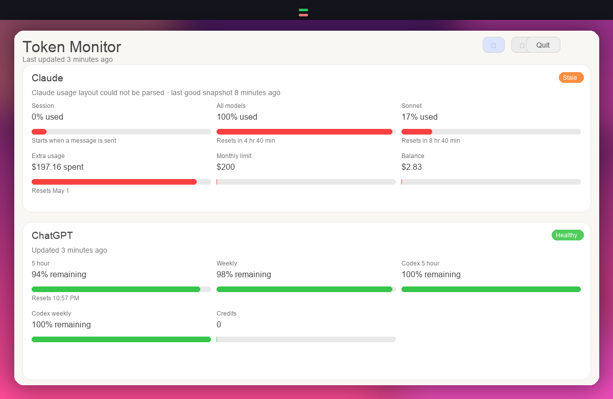

# Token Monitor

Token Monitor is a native macOS menu bar app for watching usage dashboards from Claude and ChatGPT/Codex side by side.

It keeps separate persistent WebKit sessions for each service, reads the live usage pages directly, and stores only the latest successful snapshots locally.



## English

### What it does

- Shows Claude above ChatGPT in a compact menu bar popover.
- Keeps the two accounts isolated with separate persistent WebKit storage.
- Refreshes on launch, on demand, and in the background.
- Renders the source-native usage metrics from each provider instead of inventing a combined score.
- Uses the menu bar icon to show remaining capacity at a glance.

### Download

The recommended way to install the app is through the GitHub Releases page.

Each release includes a single downloadable archive:

- `TokenMonitor-macOS.zip`

Unzip it and move `TokenMonitor.app` to `Applications`.

### Build from source

Requirements:

- macOS 14+
- Swift 6 toolchain / Command Line Tools

Run the app directly from SwiftPM:

```bash
./scripts/run-app.sh
```

Build a signed local `.app` bundle:

```bash
./scripts/build-app.sh
```

Create a release zip for distribution:

```bash
./scripts/package-release.sh
```

### Project layout

- `TokenMonitorCore` contains shared models, parsers, persistence, and dashboard state.
- `TokenMonitorApp` contains the AppKit/SwiftUI menu bar app and the WebKit session controllers.
- Each provider uses its own persistent `WKWebsiteDataStore`, so cookies and login state stay isolated.
- Local snapshots live at `~/Library/Application Support/TokenMonitor/snapshots.json`.

### Current scope

- Live mini-dashboard only
- Separate source-native metrics for Claude and ChatGPT/Codex
- Manual reconnect per provider
- Refresh on launch, popover open, manual refresh, and every 5 minutes

Not included yet:

- Historical charts
- Alerts / notifications
- Login item / auto-start
- Cross-provider normalized scoring

## Deutsch

### Was die App macht

- Zeigt Claude oberhalb von ChatGPT in einem kompakten Popover in der Menüleiste.
- Hält beide Konten mit getrenntem persistentem WebKit-Speicher sauber isoliert.
- Aktualisiert beim Start, auf Knopfdruck und im Hintergrund.
- Liest die originalen Usage-Werte jeder Plattform aus, statt einen künstlichen Gesamtwert zu bilden.
- Nutzt das Menüleisten-Icon für eine schnelle Restkapazitäts-Anzeige.

### Download

Die empfohlene Installation läuft über die GitHub-Releases-Seite.

Jedes Release enthält ein einzelnes Download-Archiv:

- `TokenMonitor-macOS.zip`

Archiv entpacken und `TokenMonitor.app` nach `Applications` verschieben.

### Build aus dem Quellcode

Voraussetzungen:

- macOS 14+
- Swift 6 Toolchain / Command Line Tools

App direkt aus SwiftPM starten:

```bash
./scripts/run-app.sh
```

Signiertes lokales `.app`-Bundle erzeugen:

```bash
./scripts/build-app.sh
```

Release-ZIP für die Verteilung bauen:

```bash
./scripts/package-release.sh
```

### Projektstruktur

- `TokenMonitorCore` enthält gemeinsame Modelle, Parser, Persistenz und den Dashboard-State.
- `TokenMonitorApp` enthält die AppKit/SwiftUI-Menüleisten-App und die WebKit-Session-Controller.
- Für jeden Provider gibt es einen eigenen persistenten `WKWebsiteDataStore`, damit Cookies und Login getrennt bleiben.
- Lokale Snapshots liegen unter `~/Library/Application Support/TokenMonitor/snapshots.json`.

### Aktueller Umfang

- Nur Live-Mini-Dashboard
- Getrennte originalgetreue Metriken für Claude und ChatGPT/Codex
- Manuelles Reconnect pro Provider
- Refresh beim Start, beim Öffnen des Popovers, manuell und alle 5 Minuten

Noch nicht enthalten:

- Verlauf / Historie
- Alerts / Benachrichtigungen
- Login-Item / Auto-Start
- Vereinheitlichte Cross-Provider-Bewertung
