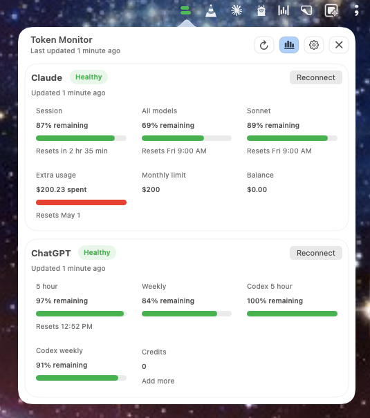
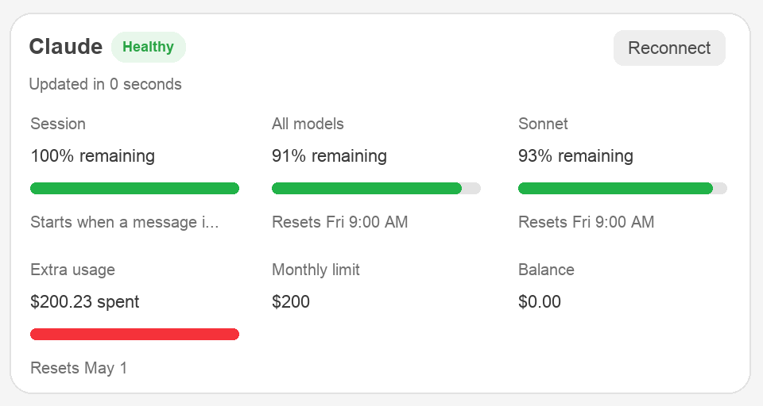
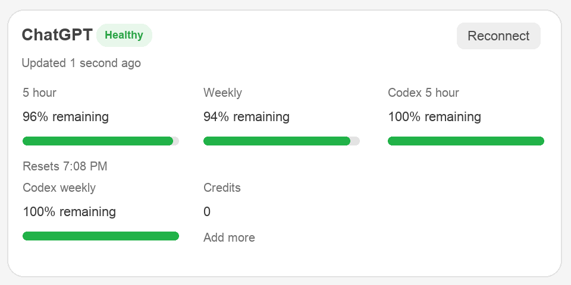
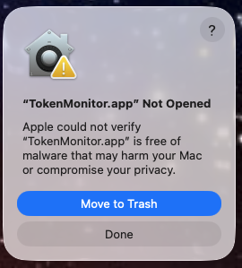
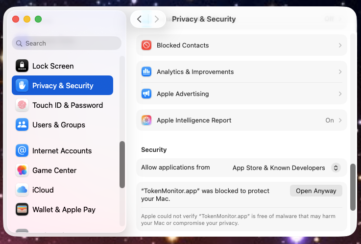
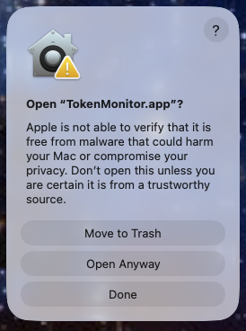
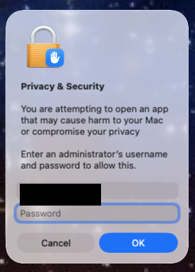

# Token Monitor

**Token Monitor** is a native macOS menu bar companion for Claude and ChatGPT/Codex usage: provider-specific limits, isolated sessions, background refresh, and Sparkle-ready update checks in one lightweight desktop app.

**Token Monitor** ist ein nativer macOS-Menüleisten-Begleiter für Claude- und ChatGPT/Codex-Nutzung: provider-spezifische Limits, getrennte Sessions, Hintergrund-Refresh und vorbereitete Sparkle-Updates in einer schlanken Desktop-App.

<p>
  <a href="https://github.com/MediaPublishing/token-monitor/releases/latest/download/TokenMonitor-macOS.dmg">
    
  </a>
</p>

> **Repository status / Repository-Status:** Public preview.


## Screenshots

### Dashboard


Watch Claude and ChatGPT/Codex side by side from the macOS menu bar.

Claude und ChatGPT/Codex bleiben direkt in der macOS-Menüleiste nebeneinander sichtbar.

### Claude Usage


Keep Claude usage source-native: session, model, Sonnet, balance, extra usage, and reset timing stay separate.

Claude bleibt quellnah: Session, Modell, Sonnet, Balance, Extra Usage und Reset-Zeit werden getrennt angezeigt.

### ChatGPT + Codex Usage


Track ChatGPT daily, weekly, Codex, and credit limits without digging through browser tabs.

ChatGPT Daily, Weekly, Codex und Credits bleiben sichtbar, ohne Browser-Tab-Suche.

---

## English

### Why Token Monitor

If your work depends on Claude and ChatGPT, the limiting factor is often not the model quality but whether you still have room left in the current window. Token Monitor closes that gap from the menu bar.

- View Claude and ChatGPT/Codex in one compact popover
- Keep each provider in its own persistent WebKit session
- Refresh on launch, on demand, and in the background
- Preserve source-native metrics instead of inventing a combined score
- Use the menu bar icon as a quick remaining-capacity signal
- Check for updates through Sparkle and the project appcast

### Requirements

- macOS 14.0 or newer
- Swift 6 toolchain / Command Line Tools for source builds
- Claude and/or ChatGPT account access

### Installation

Normal users should install from the GitHub Release DMG:

1. Download `TokenMonitor-macOS.dmg` from the latest release.
2. Open the disk image.
3. Drag `TokenMonitor.app` onto the Applications shortcut.
4. Open Token Monitor and connect Claude and ChatGPT from Settings.

Latest release download:

```text
https://github.com/MediaPublishing/token-monitor/releases/latest/download/TokenMonitor-macOS.dmg
```

#### Gatekeeper: If macOS says "TokenMonitor.app" Not Opened

Preview builds may show Apple's "could not verify" warning until the app is Developer ID signed and notarized. Only continue if you downloaded the DMG from this repository and trust that build.

1. Click **Done**, not **Move to Trash**.
2. Open **System Settings > Privacy & Security**.
3. Scroll to **Security**.
4. Find the message that `TokenMonitor.app` was blocked and click **Open Anyway**.
5. Confirm with your Mac password or Touch ID, then click **Open**.

Visual walkthrough:

| Step 1 | Step 2 |
| --- | --- |
| Click **Done**, not **Move to Trash**. | Open **System Settings > Privacy & Security** and click **Open Anyway**. |
|  |  |

| Step 3 | Step 4 |
| --- | --- |
| Confirm by clicking **Open Anyway**. | Enter your Mac password or use Touch ID, then click **OK**. |
|  |  |

macOS stores this exception for Token Monitor, so future launches should open normally. If **Open Anyway** is not visible, try opening `TokenMonitor.app` once more, then return to **Privacy & Security**. Apple's official guide is here: <https://support.apple.com/guide/mac-help/open-a-mac-app-from-an-unknown-developer-mh40616/mac>

#### DMG vs. PKG

A PKG installer would not remove this warning by itself. macOS applies Gatekeeper checks to unsigned or non-notarized downloads regardless of whether the app ships as a DMG or PKG. The durable fix is a Developer ID signed and notarized build. A PKG can still be useful later if the installer needs extra install steps, but Token Monitor's current drag-to-Applications install flow works fine as a DMG once the app is signed and notarized.

#### Launch at login

Token Monitor tries to register itself as a login item when **Launch at login** is enabled in Settings. macOS requires apps that use Apple's ServiceManagement login-item API to be code signed, so ad-hoc preview builds may not appear under **System Settings > General > Login Items**. Move `TokenMonitor.app` to **Applications**, open it once, then use **Settings > Launch at login** inside Token Monitor. If macOS still requires approval, open **Login Items** from Token Monitor Settings and allow Token Monitor there.

### Updates

Token Monitor is wired for Sparkle update checks. The appcast URL baked into the app is:

```text
https://mediapublishing.github.io/token-monitor/appcast.xml
```

When a GitHub Release is published, `.github/workflows/release.yml` can rebuild the app, upload `TokenMonitor-macOS.dmg` and `TokenMonitor-macOS.zip` to the release, and deploy `appcast.xml` plus the versioned update ZIP to GitHub Pages.

The GitHub workflow uses repository secret `SPARKLE_PRIVATE_KEY`. Maintainers can create a local release build with the Keychain entry instead:

```bash
TOKEN_MONITOR_USE_KEYCHAIN_SPARKLE_KEY=1 ./scripts/package-release.sh
```

For public distribution at scale, sign and notarize the app before publishing. If you already have Apple Developer Program access and a Developer ID Application certificate, the existing scripts can produce a signed and notarized DMG:

```bash
xcrun notarytool store-credentials token-monitor-notary
TOKEN_MONITOR_CODESIGN_IDENTITY="Developer ID Application: Your Name (TEAMID)" \
TOKEN_MONITOR_NOTARIZE=1 \
TOKEN_MONITOR_NOTARY_PROFILE=token-monitor-notary \
TOKEN_MONITOR_USE_KEYCHAIN_SPARKLE_KEY=1 \
./scripts/package-release.sh
```

Short version: DMG can stay. Developer ID signing plus notarization is the part that removes the Gatekeeper warning for normal users.

### Build From Source

```bash
git clone https://github.com/MediaPublishing/token-monitor.git
cd token-monitor
swift build
swift run TokenMonitorApp
```

Run the app directly through the project script:

```bash
./scripts/run-app.sh
```

Create a local app bundle:

```bash
./scripts/build-app.sh
open dist/TokenMonitor.app
```

Create a release ZIP and signed appcast:

```bash
TOKEN_MONITOR_USE_KEYCHAIN_SPARKLE_KEY=1 ./scripts/package-release.sh
```

Create only the local DMG installer:

```bash
./scripts/package-dmg.sh
```

### Privacy

Token Monitor stores only the latest successful usage snapshots locally at `~/Library/Application Support/TokenMonitor/snapshots.json`. Each provider uses its own persistent WebKit session, so Claude and ChatGPT login state stay isolated from each other and from your normal browser cookies.

---

## Deutsch

### Warum Token Monitor

Wenn deine Arbeit von Claude und ChatGPT abhängt, ist oft nicht die Modellqualität der Engpass, sondern ob im aktuellen Fenster noch Kapazität übrig ist. Token Monitor schließt genau diese Lücke in der Menüleiste.

- Claude und ChatGPT/Codex in einem kompakten Popover sehen
- Jeden Provider in einer eigenen persistenten WebKit-Session halten
- Beim Start, manuell und im Hintergrund aktualisieren
- Quellnahe Metriken behalten statt einen künstlichen Gesamtscore zu bauen
- Das Menüleisten-Icon als schnelles Restkapazitäts-Signal nutzen
- Updates über Sparkle und den Projekt-Appcast prüfen

### Voraussetzungen

- macOS 14.0 oder neuer
- Swift 6 Toolchain / Command Line Tools für Source-Builds
- Claude- und/oder ChatGPT-Account-Zugriff

### Installation

Normale Nutzer sollten über das GitHub-Release-DMG installieren:

1. `TokenMonitor-macOS.dmg` aus dem neuesten Release herunterladen.
2. Disk Image öffnen.
3. `TokenMonitor.app` auf die Applications-Verknüpfung ziehen.
4. Token Monitor öffnen und Claude sowie ChatGPT in den Settings verbinden.

Aktueller Release-Download:

```text
https://github.com/MediaPublishing/token-monitor/releases/latest/download/TokenMonitor-macOS.dmg
```

#### Gatekeeper: Wenn macOS "TokenMonitor.app" nicht öffnet

Preview-Builds können Apples "konnte nicht überprüfen"-Warnung zeigen, bis die App mit Developer ID signiert und notarized ist. Fahre nur fort, wenn du das DMG aus diesem Repository geladen hast und diesem Build vertraust.

1. **Fertig** klicken, nicht **In den Papierkorb legen**.
2. **Systemeinstellungen > Datenschutz & Sicherheit** öffnen.
3. Zu **Sicherheit** scrollen.
4. Die Meldung suchen, dass `TokenMonitor.app` blockiert wurde, und **Dennoch öffnen** klicken.
5. Mit Mac-Passwort oder Touch ID bestätigen, danach **Öffnen** klicken.

Visuelle Schritt-für-Schritt-Anleitung:

| Schritt 1 | Schritt 2 |
| --- | --- |
| **Fertig** klicken, nicht **In den Papierkorb legen**. | **Systemeinstellungen > Datenschutz & Sicherheit** öffnen und **Dennoch öffnen** klicken. |
|  |  |

| Schritt 3 | Schritt 4 |
| --- | --- |
| Mit **Open Anyway** bestätigen. | Mac-Passwort eingeben oder Touch ID nutzen, danach **OK** klicken. |
|  |  |

macOS speichert diese Ausnahme für Token Monitor, danach sollte die App normal starten. Wenn **Dennoch öffnen** nicht sichtbar ist, öffne `TokenMonitor.app` noch einmal und gehe danach wieder zu **Datenschutz & Sicherheit**. Apples offizielle Anleitung: <https://support.apple.com/guide/mac-help/open-a-mac-app-from-an-unknown-developer-mh40616/mac>

#### DMG vs. PKG

Eine PKG-Datei würde diese Warnung nicht automatisch entfernen. macOS prüft unsignierte oder nicht notarisierte Downloads unabhängig davon, ob die App als DMG oder PKG ausgeliefert wird. Die robuste Lösung ist ein mit Developer ID signierter und notarisierter Build. Ein PKG kann später sinnvoll sein, wenn der Installer zusätzliche Installationsschritte braucht; für Token Monitor reicht der aktuelle Drag-to-Applications-DMG-Flow, sobald die App signiert und notarisiert ist.

#### Beim Login starten

Token Monitor versucht, sich als Login Item zu registrieren, wenn **Launch at login** in den Settings aktiv ist. macOS verlangt für Apps mit Apples ServiceManagement-Login-Item-API eine Code-Signatur, deshalb erscheinen ad-hoc signierte Preview-Builds möglicherweise nicht unter **Systemeinstellungen > Allgemein > Anmeldeobjekte**. Verschiebe `TokenMonitor.app` nach **Applications**, öffne die App einmal und nutze danach **Settings > Launch at login** in Token Monitor. Wenn macOS weiterhin eine Freigabe verlangt, öffne **Anmeldeobjekte** aus den Token-Monitor-Settings und erlaube Token Monitor dort.

### Updates

Token Monitor ist für Sparkle-Update-Checks vorbereitet. Die in der App hinterlegte Appcast-URL ist:

```text
https://mediapublishing.github.io/token-monitor/appcast.xml
```

Wenn ein GitHub Release veröffentlicht wird, kann `.github/workflows/release.yml` die App neu bauen, `TokenMonitor-macOS.dmg` und `TokenMonitor-macOS.zip` in das Release hochladen und `appcast.xml` plus versioniertes Update-ZIP auf GitHub Pages deployen.

Der GitHub Workflow nutzt das Repository-Secret `SPARKLE_PRIVATE_KEY`. Maintainer können einen lokalen Release-Build mit dem Keychain-Eintrag erstellen:

```bash
TOKEN_MONITOR_USE_KEYCHAIN_SPARKLE_KEY=1 ./scripts/package-release.sh
```

Für öffentliche Verteilung in größerem Umfang sollte die App vor dem Release signiert und notarisiert werden. Wenn du bereits Zugriff auf das Apple Developer Program und ein Developer-ID-Application-Zertifikat hast, können die bestehenden Skripte ein signiertes und notarisiertes DMG bauen:

```bash
xcrun notarytool store-credentials token-monitor-notary
TOKEN_MONITOR_CODESIGN_IDENTITY="Developer ID Application: Dein Name (TEAMID)" \
TOKEN_MONITOR_NOTARIZE=1 \
TOKEN_MONITOR_NOTARY_PROFILE=token-monitor-notary \
TOKEN_MONITOR_USE_KEYCHAIN_SPARKLE_KEY=1 \
./scripts/package-release.sh
```

Kurzfassung: Das DMG kann bleiben. Developer-ID-Signierung plus Notarisierung ist der Teil, der die Gatekeeper-Warnung für normale Nutzer entfernt.

### Aus dem Source Code bauen

```bash
git clone https://github.com/MediaPublishing/token-monitor.git
cd token-monitor
swift build
swift run TokenMonitorApp
```

App direkt über das Projektskript starten:

```bash
./scripts/run-app.sh
```

Lokales App-Bundle erstellen:

```bash
./scripts/build-app.sh
open dist/TokenMonitor.app
```

Release-ZIP und signierten Appcast erstellen:

```bash
TOKEN_MONITOR_USE_KEYCHAIN_SPARKLE_KEY=1 ./scripts/package-release.sh
```

Nur den lokalen DMG-Installer erstellen:

```bash
./scripts/package-dmg.sh
```

### Datenschutz

Token Monitor speichert nur die letzten erfolgreichen Usage-Snapshots lokal unter `~/Library/Application Support/TokenMonitor/snapshots.json`. Jeder Provider nutzt eine eigene persistente WebKit-Session, damit Claude- und ChatGPT-Login getrennt bleiben und keine normalen Browser-Cookies verwendet werden.

---

## Project Structure

```text
token-monitor/
├── Package.swift
├── Sources/TokenMonitorApp/
├── Sources/TokenMonitorCore/
├── Tests/TokenMonitorCoreTests/
├── assets/
├── docs/
├── landing/
└── scripts/
```

## Documentation

- [Landing page](landing/index.html)
- [Current screenshot](docs/token-monitor-screenshot.png)

## License

License information is not published in this repository yet.
